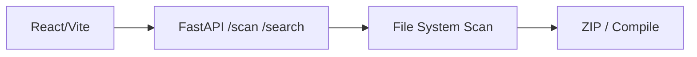

# Project File Analyzer & Compiler [](https://python.org) [](https://nodejs.org) [](.)

A full-stack developer utility for **analyzing, searching, compiling, and exporting codebases**. Built with **FastAPI (backend) + React/Vite (frontend)**.

## 🚀 Features

| Feature | Description |
|---------|-------------|
| 📂 **File Tree Explorer** | Visual project tree with syntax-highlighted previews |
| 🔍 **Global Code Search** | Full-text & regex search across all files |
| ⚡ **File Compilation** | Compile files into single/grouped documents |
| 📦 **ZIP Export** | Download full project as ZIP |
| 🛡 **Security Scanner** | Detect API keys, secrets, private keys |
| ✦ **AI Prompt Generator** | LLM-ready analysis prompts |
| 📝 **Documentation Generator** | Auto-generate `PROJECT_SUMMARY.md` |
| 🤖 **AI Chunking** | Split codebase for token limits |
| 📊 **Code Statistics** | Language breakdown, sizes, frameworks |

## 📱 Screenshots

**Main Interface**
```
┌─ File Tree ──┐ ┌─ Code Preview ──┐ ┌─ Actions ───┐
│ 📁 src/      │ │ main.py         │ │ 📊 Stats    │
│ │ App.jsx    │ │ [syntax hl]     │ │ ⚡ Compile   │
│ │ api.js     │ │                 │ │ 🛡 Security  │
│ └─ utils/    │ │                 │ │ ✦ AI Prompt │
└──────────────┘ └─────────────────┘ └────────────┘
```

**Search Results**: Instant matches with line context across files.

## 🛠 Tech Stack

| Backend | Frontend |
|---------|----------|
| Python 3.11+, FastAPI, Uvicorn | React 18, Vite, Axios |



## 🎯 Quick Start

### Option 1: One-Command (Recommended)

```bash
git clone https://github.com/your/project-analyzer.git  # or download
cd project-analyzer
chmod +x start.sh && ./start.sh   # Linux/macOS
# or double-click start.bat (Windows)
```

**Ports**:
- Frontend: http://localhost:5173
- Backend/API: http://localhost:8000
- API Docs: http://localhost:8000/docs

### Option 2: Manual

**Backend**:
```bash
cd backend
python -m venv venv && source venv/bin/activate  # Windows: venv\Scripts\activate
pip install -r requirements.txt
uvicorn main:app --reload --port 8000
```

**Frontend** (new terminal):
```bash
cd frontend
npm install && npm run dev
```

## 📖 Usage

1. Enter project path: `/path/to/your/project`
2. Click **⚡ Scan** → indexes files/tree/stats/frameworks
3. **Browse** left tree → click file for preview
4. **🔍 Search** tab for code search
5. **Right Panel Actions**:
   - 📊 View stats/frameworks
   - ⚡ Compile → download grouped TXT/ZIP
   - 📦 Export full project ZIP
   - 🛡 Security scan secrets
   - ✦ AI Prompt for LLM analysis
   - 📝 Generate docs
   - 🤖 Chunk for tokens

**Ignore Patterns**: Edit via 🚫 button (gitignore-style).

## 🔌 API Endpoints

Interactive docs: http://localhost:8000/docs

| Method | Endpoint | Description |
|--------|----------|-------------|
| `POST` | `/scan` | Scan project → files/stats/frameworks |
| `GET` | `/file` | Get file content (syntax-ready) |
| `POST` | `/search` | Global search (regex optional) |
| `POST` | `/compile/download` | Compile → downloadable ZIP |
| `POST` | `/export/zip` | Full project ZIP export |
| `POST` | `/security/scan` | Secret/API key detector |
| `POST` | `/generate/ai-prompt` | LLM analysis prompt |
| `POST` | `/generate/documentation` | `PROJECT_SUMMARY.md` generator |
| `POST` | `/chunk/ai` | Token-aware code chunks |

## 🏗 Project Structure

```
project-analyzer/
├── backend/                 # FastAPI API
│   ├── main.py             # All endpoints
│   └── requirements.txt    # FastAPI/Uvicorn/Pydantic
├── frontend/               # React/Vite SPA
│   ├── src/
│   │   ├── App.jsx         # Main layout
│   │   ├── components/     # FileTree, CodeViewer, etc.
│   │   └── utils/api.js    # Axios client
│   ├── package.json
│   └── vite.config.js
├── start.sh / start.bat    # 🚀 One-command start
├── README.md              # This file
└── INSTALL.md             # Setup guide
```

## ⚙️ Configuration

- **Ignore**: Edit via UI 🚫 (e.g., add `*.min.js`)
- **Max File Size**: Compile defaults 500KB
- **Routing Rules**: Compile groups by extension (py→backend, jsx→frontend)

## 📋 Requirements

```
Python 3.11+    Node 18+    npm 9+
FastAPI 0.111    React 18    Vite 5.3
```

Auto-installed by `start.sh`.

## 🤝 Contributing

See [CONTRIBUTING.md](CONTRIBUTING.md)

## 📄 License

MIT License — see [LICENSE](LICENSE) (create if needed).

## 🙏 Acknowledgments

Built for developers analyzing codebases at scale.

---
*Last Updated: October 2024*

